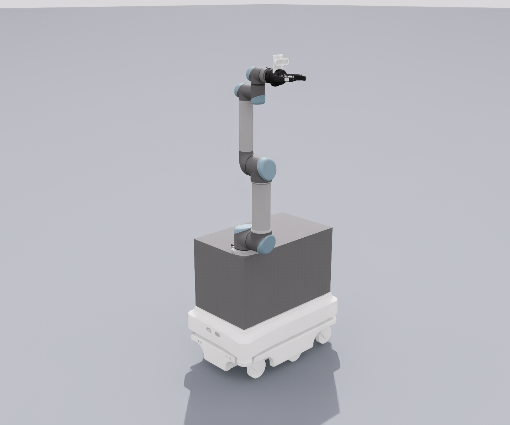

# MiR100 + UR5 + D435i + Robotiq85



This workspace integrates the MiR100 mobile base, the UR5 arm, the Robotiq 85
gripper and a RealSense D435i, and supports Isaac Sim, Gazebo Classic and the
real robot. Isaac and Gazebo share the same ROS 2 Control, Nav2 and MoveIt2
configuration.

## Pick what you want to do first

| Goal | Where to start |
|---|---|
| Drive the maze in the Isaac GUI and send nav goals from RViz | Follow the 4 terminals in the next section |
| Map or navigate in Gazebo | [Gazebo demo](#gazebo-demo) |
| Operate the real MiR100 + UR5 | [Real robot demo](#real-robot-demo-mir100--ur5-hardware) |
| Change the USD, the sensors or the physics parameters | [`isaac_sim/README_isaac.md`](isaac_sim/README_isaac.md) |
| Look up known Isaac / Nav2 issues and measured results | [`isaac_debug.md`](isaac_debug.md) |

## Paths used in this README

Every command below is written against three variables instead of absolute
paths. Set them once (add them to `~/.bashrc`) and the rest of the document
works unchanged on any machine:

```bash
export MIR_WS=~/ros2_ws                                  # colcon workspace (holds src/ and install/)
export MIR_REPO=$MIR_WS/src/mir_ur5_humble               # this repository
export ISAAC_PYTHON=~/IsaacSim/_build/linux-x86_64/release/python.sh
```

`ISAAC_PYTHON` must be an interpreter that can `import omni` / `pxr` — either
Isaac Sim's own `python.sh` from your build, or a conda env with Isaac Sim
installed. It is only needed for the Isaac path; Gazebo and the real robot
ignore it. Everything else (maps, RViz configs, MoveIt configs) is resolved
through `ros2 pkg prefix`, so it needs no path of its own.

## Quick start: Isaac Sim maze navigation (GUI)

This is the currently verified startup path, and the one that behaves closest
to Gazebo. Isaac, ROS Control, AMCL and Nav2 are started separately, which also
makes it easiest to tell which layer is at fault when something breaks.

### 0. Build first (on first use, or after changing code)

```bash
cd $MIR_WS
source /opt/ros/humble/setup.bash
colcon build --symlink-install
source install/setup.bash
```

### 1. Terminal 1: start the Isaac GUI and the maze

```bash
"$ISAAC_PYTHON" "$MIR_REPO/isaac_sim/mir_isaac_sim.py" \
  --lasers \
  --world "$MIR_REPO/isaac_sim/usd/maze.usd" \
  --top-down
```

Wait until Isaac has finished loading and is stepping the simulation before
opening the other terminals. Isaac is the `/clock` source; if you restart Isaac
mid-run, the three ROS launches below must be restarted with it.

### 2. Terminal 2: ROS Control, RViz and the dual-laser merger

```bash
cd $MIR_WS
source /opt/ros/humble/setup.bash
source install/setup.bash

ros2 launch mir_description mir_isaac.launch.py launch_moveit:=false
```

This launch already includes the robot state publisher, ROS Control, RViz and
`/f_scan + /b_scan -> /scan`; do not start a separate scan merger. If you also
want to move the UR5 arm, just drop `launch_moveit:=false`.

### 3. Terminal 3: localize against the existing maze map

```bash
cd $MIR_WS
source /opt/ros/humble/setup.bash
source install/setup.bash

ros2 launch mir_navigation amcl.py use_sim_time:=true \
  map:=$(ros2 pkg prefix mir_navigation)/share/mir_navigation/maps/maze.yaml
```

### 4. Terminal 4: start Nav2

```bash
cd $MIR_WS
source /opt/ros/humble/setup.bash
source install/setup.bash

ros2 launch mir_navigation navigation.py use_sim_time:=true \
  cmd_vel_w_prefix:=/diff_cont/cmd_vel_unstamped
```

### 5. Drive it from RViz

1. Use **2D Pose Estimate** to set the base's initial position and heading on
   the map.
2. Once the laser scan lines up with the map, drag a goal arrow with
   **Nav2 Goal**.
3. The arrow direction is also the final heading. After reaching the goal
   position the base may turn in place to that heading; navigation is only
   complete once Nav2 reports `Goal succeeded`.

Quick checks:

```bash
ros2 topic hz /scan                         # about 12 Hz
ros2 control list_controllers               # controllers should be active
ros2 lifecycle get /amcl                    # active
ros2 lifecycle get /bt_navigator            # active
```

If a goal is accepted but the base does not move, check `/scan` and AMCL first,
then confirm Isaac has not been restarted. Measured results for narrow maze
gaps, turning in place and stress tests are in
[`isaac_debug.md`](isaac_debug.md).

# Installation

## Preliminaries
## ROS2
If you haven't already installed [ROS2](https://docs.ros.org/en/humble/Installation/Ubuntu-Install-Debians.html) on your PC, you need to add the ROS2 apt repository.

Also install ros2-control, ros2-controllers, gazebo-ros-pkgs(usually installed), gazebo-ros2-control

```
sudo apt-get install ros-humble-ros2-control
sudo apt-get install ros-humble-ros2-controllers
sudo apt-get install ros-humble-gazebo-ros-pkgs
sudo apt-get install ros-humble-gazebo-ros2-control
sudo apt install ros-humble-gripper-controllers
sudo apt install ros-humble-rmw-cyclonedds-cpp
sudo apt install ros-humble-sensor-msgs
```

For the Isaac Sim back-end and the Nav2 stack also install:

```
sudo apt install ros-humble-topic-based-ros2-control
sudo apt install ros-humble-navigation2 ros-humble-nav2-bringup ros-humble-slam-toolbox
sudo apt install ros-humble-pcl-ros ros-humble-pcl-conversions
```

## Source install

`MIR_WS` / `MIR_REPO` are the variables from
[Paths used in this README](#paths-used-in-this-readme) — pick your own
workspace location here and the rest of the document follows it.

```
# create a ros2 workspace
export MIR_WS=~/ros2_ws
mkdir -p $MIR_WS/src
cd $MIR_WS

# clone this repository into the workspace
git clone https://github.com/eugene900805/mir_ur5_humble.git src/mir_ur5_humble
export MIR_REPO=$MIR_WS/src/mir_ur5_humble

# use vcs to fetch linked repos
# $ sudo apt install python3-vcstool
vcs import < $MIR_REPO/mir_robot/ros2.repos src --recursive

# use rosdep to install all dependencies (including ROS itself)
sudo apt update
sudo apt install -y python3-rosdep
rosdep update --rosdistro=humble
rosdep install --from-paths src --ignore-src -r -y --rosdistro humble

# build all packages in the workspace
echo "source /opt/ros/humble/setup.bash" >> ~/.bashrc
echo "source $MIR_WS/install/setup.bash" >> ~/.bashrc
echo ". /usr/share/gazebo/setup.sh" >> ~/.bashrc
source ~/.bashrc
cd $MIR_WS
colcon build --symlink-install
```

# Gazebo demo

Run this first in every terminal:

```bash
cd $MIR_WS
source /opt/ros/humble/setup.bash
source install/setup.bash
```

### Navigating with an existing map

Open three terminals in order:

```bash
# Terminal 1: Gazebo maze + RViz
ros2 launch mir_gazebo mobile_manipulator.launch.py world:=maze \
  rviz_config_file:=$(ros2 pkg prefix mir_navigation)/share/mir_navigation/rviz/mir_nav.rviz

# Terminal 2: AMCL localization
ros2 launch mir_navigation amcl.py use_sim_time:=true \
  map:=$(ros2 pkg prefix mir_navigation)/share/mir_navigation/maps/maze.yaml

# Terminal 3: Nav2
ros2 launch mir_navigation navigation.py use_sim_time:=true \
  cmd_vel_w_prefix:=/diff_cont/cmd_vel_unstamped
```

In RViz press **2D Pose Estimate** first, and only press **Nav2 Goal** once the
laser scan lines up with the map.

### Mapping with SLAM

Terminal 1 still starts Gazebo; replace Terminal 2 with:

```bash
ros2 launch mir_navigation mapping.py use_sim_time:=true \
  slam_params_file:=$(ros2 pkg prefix mir_navigation)/share/mir_navigation/config/mir_mapping_async_sim.yaml
```

If you want to navigate automatically while mapping, also start Terminal 3 from
above.

### MoveIt2 (optional)

```bash
ros2 launch ur_moveit_config ur_moveit.launch.py \
  ur_type:=ur5 prefix:=ur_ launch_rviz:=true \
  use_fake_hardware:=true use_sim_time:=true
```

# Isaac Sim options

The full GUI maze navigation walkthrough is at the top of this README. This
section only lists the common variations; for the full description of the
sensors, USD conversion and physics parameters see
[`isaac_sim/README_isaac.md`](isaac_sim/README_isaac.md).

### Start Isaac + ROS Control + RViz with a single command

```bash
ros2 launch mir_description mir_isaac.launch.py \
  launch_isaac:=true world:=maze top_down:=true launch_moveit:=false
```

This takes fewer commands; when you need to watch the Isaac and ROS output
separately, the 4-terminal flow above is still recommended. `launch_isaac:=true`
is the only mode that needs `ISAAC_PYTHON` to be exported — it starts
`mir_isaac_sim.py` itself.

### Switching to SLAM mapping

Keep Terminals 1, 2 and 4 of the quick start and replace AMCL with:

```bash
ros2 launch mir_navigation mapping.py use_sim_time:=true \
  slam_params_file:=$(ros2 pkg prefix mir_navigation)/share/mir_navigation/config/mir_mapping_async_sim.yaml
```

### Common launch options

```bash
# No Isaac GUI (the PhysX lasers still work)
ros2 launch mir_description mir_isaac.launch.py \
  launch_isaac:=true world:=maze headless:=true launch_rviz:=false launch_moveit:=false

# ROS Control only, without MoveIt, RViz or the scan merger
ros2 launch mir_description mir_isaac.launch.py \
  launch_moveit:=false launch_rviz:=false launch_scan_merger:=false
```

Isaac publishes `/f_scan`, `/b_scan`, `/odom` and `odom -> base_footprint`; the
ROS launch merges the two lasers into `/scan` by default.
`diffdrive_controller_isaac.yaml` only overrides `enable_odom_tf: false`, so that
ROS Control and Isaac do not publish the same TF twice. All other controller
parameters are shared with Gazebo through `diffdrive_controller.yaml`, which
keeps the two simulators' settings from drifting apart.

# Real robot demo (MiR100 + UR5 hardware)

> Full debugging notes (WiFi keepalive, controller choice, shared localization,
> all symptoms → root causes → fixes, in Chinese) are in
> **[`claude_debug.md`](claude_debug.md)**.

The MiR's address depends on which WiFi the PC is on, so don't hardcode it —
auto-detect it (tries `mir.com`, then known addresses, then scans the subnet
for rosbridge port 9090):

```
export MIR_HOST=$($MIR_REPO/tools/find_mir.sh)
ros2 launch mir_navigation mir_nav_launch.py mir_hostname:=$MIR_HOST
```

The two cases the script covers, with our lab's values as an example — yours
will differ, and the UR5 control box has its own fixed address on the same
subnet (`192.168.0.101` here, set it as `UR_HOST`):

| WiFi network | MiR address | Note |
|---|---|---|
| MiR's own hotspot | `192.168.12.20` | the robot's DNS resolves `mir.com` to itself |
| a lab router the MiR joins as a client | DHCP, e.g. `192.168.0.104` | found by the subnet scan |

The PC's own IP never needs to be typed anywhere: the UR driver auto-detects
its reverse-connection IP (headless mode) and the MiR bridge connects outward.
After switching WiFi: restart the UR driver (its reverse IP was baked in at
startup), restart the nav stack with the new `mir_hostname`, and disable WiFi
power-save on the **new** connection profile
(`nmcli connection modify "<SSID>" 802-11-wireless.powersave 2`, then
down/up) — power-save causes the periodic outages that break External Control.

Run each block in its own terminal; every terminal needs
`cd $MIR_WS && source install/setup.bash` first (system python, **not** conda),
plus the `UR_HOST` / `MIR_HOST` from above.

```
### Terminal 1 — UR5 driver (headless External Control, no teach pendant needed)
ros2 launch ur_robot_driver ur_control.launch.py \
    ur_type:=ur5 robot_ip:=$UR_HOST tf_prefix:=ur_ \
    launch_rviz:=false launch_rsp:=false headless_mode:=true \
    initial_joint_controller:=passthrough_trajectory_controller \
    activate_joint_controller:=true controller_spawner_timeout:=60

### Terminal 2 — MoveIt (drag the goal ball in RViz -> Plan & Execute)
ros2 launch ur_moveit_config ur_moveit.launch.py ur_type:=ur5 prefix:=ur_ launch_rviz:=true

### Terminal 3 — MiR navigation (bridge + Nav2 + RViz, shares the robot's own
###              localization/map with the MiR web UI -> no 2D Pose Estimate needed)
ros2 launch mir_navigation mir_nav_launch.py mir_hostname:=$MIR_HOST

### Terminal 4 — laser scan merger (required; QoS flags matter on hardware)
ros2 launch mir_description mir_isaac_scan_merger.launch.py use_sim_time:=false best_effort:=true
```

Then send **Nav2 Goal** in the navigation RViz to drive the base, and
**Plan & Execute** in the MoveIt RViz to move the arm.

Key points (details in `claude_debug.md`):

- `launch_rsp:=false` — the MiR combined model already publishes the arm TF;
  a second robot_state_publisher from the driver corrupts the TF tree.
- `headless_mode:=true` — the driver injects the External Control URScript
  itself; the pendant program (`test.urp`) is irrelevant and must NOT be
  played. If the script stops, resend with
  `ros2 service call /io_and_status_controller/resend_robot_program std_srvs/srv/Trigger`
  (takes ~6 s). Occasional drops are caused by an **unstable router/WiFi** —
  if your network is solid you can ignore this entirely. On a flaky link (our
  2.4 GHz MiR hotspot drops every ~10-15 min even at the 5 s watchdog maximum)
  keep `$MIR_REPO/tools/ur_program_watchdog.sh` running in a 5th terminal; it
  auto-resends within seconds.
- `initial_joint_controller` selects the trajectory controller:
  `passthrough_trajectory_controller` (whole trajectory interpolated on the
  robot — smooth over WiFi, default) vs `scaled_joint_trajectory_controller`
  (125 Hz streaming — stutters over WiFi). MoveIt follows whichever is active.
- WiFi keepalive: workspace-vendored `ur_client_library` raises
  `MAX_RT_RECEIVE_TIMEOUT_MS` 200 ms → 5000 ms and `keep_alive_count`
  (xacro arg, default 250 = 5 s) sets the watchdog; WiFi power-save is
  disabled on the AP connection. Without these the External Control
  connection drops within seconds.
- `use_mir_localization:=true` (default) — RViz always shows the same pose as
  the MiR web UI (`mir_localization_tf` converts `/robot_pose` into the
  map→odom TF); no local AMCL/map_server. Old behavior:
  `use_mir_localization:=false map:=maze.yaml`.
- Speed limits are launch args: real-robot defaults `max_vel_x:=0.3`,
  `max_vel_theta:=0.5` (simulation defaults: 1.2 m/s, 1.0 rad/s). Override:
  `max_vel_x:=0.5 max_vel_theta:=0.8`.
- Before relaunching, kill leftovers or duplicate action servers break Nav2
  (`unknown goal response`):
  `pkill -f mir_nav_launch.py; pkill -f mir_launch.py; pkill -f twist_stamper; pkill -f teleop_twist_keyboard; pkill xterm`

# Running on another machine

Setting `MIR_WS`, `MIR_REPO` and `ISAAC_PYTHON`
([above](#paths-used-in-this-readme)) covers every command in this README. No
absolute path is baked into the launch files:

| Launch arg | Where its default comes from |
|---|---|
| `isaac_python` | `$ISAAC_PYTHON`; the launch aborts with a clear message if it is unset |
| `isaac_dir` | `$MIR_ISAAC_DIR`, else `isaac_sim/` is derived from the launch file's own location in this checkout |

Both are only read when `launch_isaac:=true`; the 4-terminal quick start starts
Isaac itself and never touches them. The `isaac_dir` derivation needs the
`--symlink-install` build used throughout this README (a plain copying build
breaks the link back to the source tree — then pass `isaac_dir:=` explicitly).

Other portability notes:
- `mir_isaac_sim.py` is meant to be run directly; its `--usd` default is computed
  relative to the script, so it is path-independent. Only `--world` takes a full
  path.
- Run the script with **Isaac's own python** (`python.sh`) or an env that can
  import `omni.*` / `pxr`; plain system python cannot load the Isaac modules.
- Isaac's shipped lidar-config dir may contain a symlink to an Isaac Sim
  location that does not exist on your machine; this only affects *custom RTX*
  lidar profiles — the default PhysX `--lasers` path is unaffected.
- After editing any `mir_description/config/*.yaml` or launch file, rebuild
  (`colcon build --packages-select mir_description`) so the `install/` copy used
  at runtime is refreshed (or edit the `install/` copy too).

# Notes

1. If you get an error with respect to Gazebo Classic: Cannot launch gzclient on a launch file - results in shared_ptr assertion error, 

    All you have to do is, source the gazebo classic by`. /usr/share/gazebo/setup.sh`
    and try again

2. If you encounter an error with respect to launching the ur_moveit launch:  Exception caught while processing action 'loadRobotModel': parameter 'robot_description_planning.joint_limits.panda_joint1.max_velocity' has invalid type: Wrong parameter type, parameter {robot_description_planning.joint_limits.panda_joint1.max_velocity} is of type {double}, setting it to {string} is not allowed,

    All you have to do is set `LC_NUMERIC=en_US.UTF-8` in your terminal and try again

3. If you get an error about gazebo already open elsewhere, run this -

    `killall gzserver `
    
## Acknowledgement

The 3d files for MiR 100 is from [DFKI](https://github.com/DFKI-NI/mir_robot).
The 3d model and plugins for UR5 are from [Universal_Robots_ROS2_Driver](https://github.com/UniversalRobots/Universal_Robots_ROS2_Driver).
The Realsense plugin is from [PAL Robotics](https://github.com/pal-robotics/realsense_gazebo_plugin/tree/foxy-devel) and description from [Intel](https://github.com/IntelRealSense/realsense-ros).
