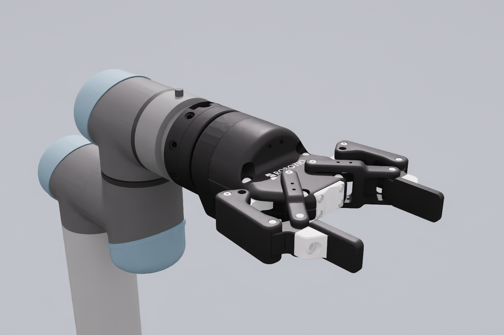

# MiR100 + UR5 + Robotiq85 — Isaac Sim back-end (replaces Gazebo)

The default wrist assembly is now **UR5 → FT 300 → Robotiq Wrist Camera →
2F-85**, replacing the D435i and its interfering bracket. The gripper mounting frame is 55 mm
farther along tool Z. These additions are mechanical models/TF frames;
Robotiq camera images and FT wrench publishing are not implemented. CAD
sources, dimensions and assumptions are documented in
[the wrist model notes](../mir_robot/mir_description/meshes/robotiq_wrist/README.md).




Regenerate the README, robot, wrist and maze preview images with
`python isaac_sim/render_check.py` using the Isaac Lab Python environment.
The script poses a temporary stage for rendering; it does not change the USD
or send commands to the running robot.

This integrates **NVIDIA Isaac Sim 5.0** as the physics/rendering simulator for
the `mir_ur5_humble` robot, in place of Gazebo Classic, while keeping the
**ros2_control + MoveIt2** stack unchanged. Isaac Sim drives the robot
articulation; ROS talks to it through the
[`topic_based_ros2_control`](https://github.com/PickNikRobotics/topic_based_ros2_control)
hardware interface — the same pattern NVIDIA uses in its MoveIt sample.

```
        ┌─────────────────────────── Isaac Sim (mir_isaac_sim.py) ───────────────────────────┐
        │  USD articulation /World/Robot   +   ROS2 OmniGraph bridge                          │
        │     publishes  /isaac_joint_states (sensor_msgs/JointState, all joints)             │
        │     publishes  /clock             (rosgraph_msgs/Clock)                             │
        │     subscribes /isaac_arm_commands     ──► ArticulationController  (UR arm)          │
        │     subscribes /isaac_base_commands    ──► ArticulationController  (MiR wheels)      │
        │     subscribes /isaac_gripper_commands ──► ArticulationController  (Robotiq)         │
        └───────▲───────────────────────────────────────────────────────┬────────────────────┘
                │ joint states                                            │ joint commands (3 topics)
                │                                                         ▼
        ┌───────┴─────────────────────────────────────────────────────────────────────────────┐
        │  ros2_control_node (controller_manager)                                              │
        │    hardware = 3x topic_based_ros2_control/TopicBasedSystem (sim_isaac:=true)          │
        │      UR -> /isaac_arm_commands   MiR -> /isaac_base_commands   Robotiq -> /...gripper │
        │    controllers: joint_broadcaster, diff_cont,                                         │
        │                 joint_trajectory_controller, gripper_position_controller             │
        └───────▲───────────────────────────────────────────────────────┬─────────────────────┘
                │ joint_states                                            │ FollowJointTrajectory / GripperCommand
                ▼                                                         │
        robot_state_publisher → /tf                              MoveIt2 move_group + RViz
```

### Why three command topics (not one)

The robot has **three** `ros2_control` hardware components (UR arm, MiR base,
Robotiq gripper), each a `TopicBasedSystem`. If they all publish to a single
`/isaac_joint_commands`, the three C++ publishers at 100 Hz interleave on that
topic and the bridge — which applies the *latest* received message each sim
frame — keeps getting base/gripper messages and **starves the arm of commands**,
so the arm never moves and MoveIt aborts with `PATH_TOLERANCE_VIOLATED`. (This
only shows up in the full stack; publishing the same messages from one node
works fine.) Giving each component its **own** command topic, with one
`SubscribeJointState → ArticulationController` chain per topic in the bridge,
removes the contention. Joint **states** stay on a single `/isaac_joint_states`
(one publisher, many subscribers — no contention).

## What changed vs. the Gazebo setup

| File | Change |
|------|--------|
| `ur_description/urdf/ur.ros2_control.xacro` | added `sim_isaac` → `topic_based_ros2_control/TopicBasedSystem` |
| `ur_description/urdf/ur_macro.xacro` | plumb `sim_isaac` / isaac topics through |
| `mir_description/urdf/include/mir_100_v1.urdf.xacro` | declare `sim_isaac` arg; UR → `/isaac_arm_commands`, Robotiq → `/isaac_gripper_commands` |
| `mir_description/urdf/mir.urdf.xacro` | MiR base `ros2_control` switches Gazebo↔Isaac (→ `/isaac_base_commands`); Gazebo plugin gated by `sim_gazebo` |
| `robotiq_gripper.ros2_control.xacro` | already supported `sim_isaac` (upstream) |
| `mir_description/launch/mir_isaac.launch.py` | **new** — ROS side of the Isaac integration |
| `isaac_sim/` | **new** — USD, converter, Isaac Sim bridge script |

The Gazebo path is untouched: `sim_isaac` defaults to `false`, so
`ros2 launch mir_gazebo mobile_manipulator.launch.py` still runs Gazebo.

## Joint-name match (why it works)

The bridge matches joints **by name** between ROS and Isaac. The USD is
regenerated from *this repo's* xacro, so the articulation joints are exactly the
ROS names: `ur_shoulder_pan_joint … ur_wrist_3_joint`, `left_wheel_joint`,
`right_wheel_joint`, `robotiq_85_left_knuckle_joint` (+ 5 mimic-coupled gripper
joints), and the caster joints. Articulation root: `/World/Robot/base_footprint`.

---

## 1. Prerequisites

- Isaac Sim 5.0 (source build or binary release — it provides `python.sh`).
- Isaac Lab, if you want to *regenerate* the USD (a conda env works).
- ROS 2 Humble with `ros-humble-topic-based-ros2-control`, `ros-humble-moveit`,
  `ros2_control`, `ros2_controllers`.

This document uses the same variables as the top-level
[README](../README.md#paths-used-in-this-readme):

```bash
export MIR_WS=~/ros2_ws                                  # colcon workspace
export MIR_REPO=$MIR_WS/src/mir_ur5_humble               # this repository
export ISAAC_PYTHON=~/IsaacSim/_build/linux-x86_64/release/python.sh
```

## 2. Build the ROS workspace

```bash
cd $MIR_WS
# system python for ROS (not the conda one):
PATH=/usr/bin:/bin:/opt/ros/humble/bin:$PATH PYTHONPATH= \
  colcon build --cmake-args -DPython3_EXECUTABLE=/usr/bin/python3
source install/setup.bash
```

(If you only want the Isaac path, the minimal set is
`mir_description ur_description robotiq_description realsense2_description
ur_moveit_config`.)

## 3. (Optional) Regenerate the USD

A ready-made USD is already at `isaac_sim/usd/mir_isaac.usd`. To rebuild it from
the xacro (e.g. after changing the robot):

Run these from the repository root, with a python that can import Isaac Lab
(`$ISAAC_PYTHON` or your Isaac Lab conda env — plain system python won't do):

```bash
cd $MIR_REPO
source $MIR_WS/install/setup.bash          # so ros2 pkg prefix resolves

# 3a. xacro → URDF (Isaac hardware interface selected)
xacro $(ros2 pkg prefix mir_description)/share/mir_description/urdf/mir.urdf.xacro \
     sim_isaac:=true sim_gazebo:=false ur_type:=ur5 > isaac_sim/mir_isaac_raw.urdf
# 3b. make the URDF self-contained & importer-safe
python isaac_sim/make_isaac_urdf.py isaac_sim/mir_isaac_raw.urdf isaac_sim/mir_isaac.urdf
# 3c. URDF → USD (Robotiq mimic joints preserved)
python isaac_sim/convert_to_usd.py
# This also applies the wrist colors from URDF (the STL importer defaults to white).
# 3d. fix the importer's .dae visual orientation (Isaac Sim 5.0 bug)
python isaac_sim/fix_dae_orientation.py isaac_sim/usd/configuration/mir_isaac_base.usd
# 3e. repair the broken Robotiq left-chain mimic joint (inf limit / missing referenceJoint)
python isaac_sim/fix_mimic_limits.py
```

Do re-run this after any change to the shared xacro — the USD is a snapshot, and
a stale one drifts silently. Example: the MiR100 spec fix raised the wheel joint
limit 20 → 24 rad/s, and until the USD was rebuilt PhysX still capped the wheels
at `physxJoint:maxJointVelocity = 1145.9 °/s` (20 rad/s = 1.25 m/s) while ROS
believed it could command 1.5 m/s.

The maze environment is a separate stage built from the Gazebo world, so the two
simulators drive through identical geometry:

```bash
python isaac_sim/convert_maze_to_usd.py     # mir_gazebo/worlds/include/maze/model.sdf -> usd/maze.usd
```

The background on each of these fixes (why the importer needs them, what breaks
without them) is in [`../isaac_debug.md`](../isaac_debug.md).

## 4. Run

**Terminal 1 — Isaac Sim** (publishes `/clock`, `/isaac_joint_states`; subscribes `/isaac_{arm,base,gripper}_commands`):

```bash
"$ISAAC_PYTHON" "$MIR_REPO/isaac_sim/mir_isaac_sim.py"
#   add --headless to run without a GUI
#   odom→base_footprint + /odom (Isaac ground truth) are published by DEFAULT;
#   --no-publish-odom turns them off, but then you must also flip the ROS side
#   to enable_odom_tf:=true or nothing publishes that transform at all
```

Or bring up both halves with one command (`launch_isaac:=true` starts
`mir_isaac_sim.py` as a child process of the launch, matching the Gazebo
workflow):

```bash
ros2 launch mir_description mir_isaac.launch.py launch_isaac:=true world:=maze
#   picks up $ISAAC_PYTHON; override with isaac_python:=<path> if you prefer
```

**Terminal 2 — ROS control + MoveIt + RViz:**

```bash
cd $MIR_WS && source install/setup.bash
ros2 launch mir_description mir_isaac.launch.py
#   launch_moveit:=false  launch_rviz:=false   to drop pieces
```

Plan in the RViz MotionPlanning panel and hit **Plan & Execute** — the arm moves
in Isaac Sim. Drive the base with:

```bash
ros2 topic pub /diff_cont/cmd_vel_unstamped geometry_msgs/msg/Twist \
  "{linear: {x: 0.2}, angular: {z: 0.3}}"
```

Open/close the gripper (single master joint, 5 joints follow via PhysX mimic):

```bash
ros2 action send_goal /gripper_position_controller/gripper_cmd \
  control_msgs/action/GripperCommand "{command: {position: 0.7}}"
```

## 5. Sensors

| Sensor | ROS topic | Status |
|---|---|---|
| Joint states (all 22 movable joints) | `/isaac_joint_states` | ✅ ~50 Hz |
| Sim clock | `/clock` | ✅ |
| IMU (`imu_link`) | `/imu_data` (`sensor_msgs/Imu`) | ✅ ~50 Hz |
| 2× SICK S300 lidars (PhysX) | `/f_scan`, `/b_scan` (`sensor_msgs/LaserScan`) | ✅ `--lasers`, ~12 Hz (headless OK) |
| 2× SICK S300 lidars (RTX) | `/f_scan`, `/b_scan` (`sensor_msgs/LaserScan`) | ⚠️ `--rtx-lasers`, needs viewport |
| Intel D435i RGB-D (RTX) | `/realsense/{color/image_raw, depth/image_rect_raw, color/camera_info}` | ⚠️ `--camera`, needs viewport |

> ### ⛔ Two SICK S300 lidars — do NOT replace with one
>
> The real MiR100 carries **two** SICK S300 safety scanners, mounted at the
> **front-left** and **back-right** corners, each with a 240° field of view. The
> simulation **must** keep both (`/f_scan` + `/b_scan`) and merge them through
> `ira_laser_tools` into `/scan`, exactly like the Gazebo stack.
>
> **Replacing the two scanners with a single 360° lidar at the robot centre
> (`virtual_laser_link`) is STRICTLY FORBIDDEN.** Even though one centre lidar
> looks like an easy way to get "full coverage", it is not a faithful model of
> the hardware: it removes the real corner mounting parallax, the per-sensor
> blind sectors, and the front/back `/f_scan` `/b_scan` topics the rest of the
> stack (and any safety logic) depends on. If coverage looks incomplete, fix the
> **two-sensor** path (sensor pose/orientation in the USD, or the merger
> parameters) — never substitute a single lidar.

Lidars and the camera are **opt-in**:

```bash
SIM="$ISAAC_PYTHON $MIR_REPO/isaac_sim/mir_isaac_sim.py"

# Headless-safe: PhysX lidar (pure ray-cast, no render product)
$SIM --lasers

# Physically-based RTX lidar (needs viewport, not headless)
$SIM --rtx-lasers

# Camera (needs viewport)
$SIM --rtx-lasers --camera
```

### Two lidar modes

#### PhysX lidar (`--lasers`) — headless OK

Pure-OmniGraph ray-cast: `RangeSensorCreateLidar → IsaacReadLidarBeams →
ROS2PublishLaserScan`. No render product, no SDG pipeline. SICK S300 parameters:
0.05–29 m, ±120° (240° FOV), 541 samples. Works headless and is the default
choice for Nav2 / SLAM runs. A simulation gate publishes every fifth 60 Hz tick
(12 Hz), matching Gazebo's 12.5 Hz SICK update rate without flooding AMCL,
costmaps and MPPI with duplicate scans.

The imported chassis mesh encloses the two corner-mounted ray origins, so its
collider is excluded from lidar queries. The script restores physical wall
contact with an invisible, low-profile `0.89 × 0.58 m` chassis collision proxy
below the laser plane. This keeps the Gazebo/Nav2 footprint while preventing
the scanners from seeing the robot itself and prevents wheel/caster-only wall
contacts from wedging the articulation at the maze entrance.

#### RTX lidar (`--rtx-lasers`) — needs viewport

Uses `IsaacSensorCreateRtxLidar` with the `SICK_S300.json` profile (placed in
`isaac_sim/usd/` and also copied to Isaac Sim's built-in SICK config directory).
The sensor prim is an `OmniLidar` with `OmniSensorGenericLidarCoreAPI`; the
ROS2 `LaserScan` is published by an `isaacsim.ros2.bridge.ROS2RtxLidarHelper`
OG node (`type = laser_scan`).

**Important — render-product render vars.** The helper needs a render product
created with the RTX-lidar render vars
`["GenericModelOutput", "RtxSensorMetadata"]`. The camera-oriented
`IsaacCreateRenderProduct` OG node does **not** set these, so a render product
from that node carries no lidar data and the helper publishes nothing (this was
the original "RTX lidar doesn't work" symptom). We instead build the render
product directly in Python:

```python
rp = rep.create.render_product(
    lidar_path, resolution=(128, 128),
    render_vars=["GenericModelOutput", "RtxSensorMetadata"], force_new=True)
# then: ROS2RtxLidarHelper.inputs:renderProductPath = rp.path
```

This is the exact pattern that passes in
`isaacsim.ros2.bridge` `test_rtx_sensor.py::_test_rtx_lidar_laser_scan` on this
Isaac Sim 5.0 build.

RTX lidar benefits: physically-based reflectance model, configurable range noise
(`rangeAccuracyM = 0.029 m`), realistic timing (13 Hz scan rate, 541 rays fired
sequentially). Drawback: requires a viewport and a GPU capable of ray tracing —
use `--lasers` (PhysX) for headless SLAM/Nav runs.

**SICK S300 mounting on MiR100**: the two sensors are at the *front-left* and
*back-right* corners of the chassis (not purely front/back). Each sensor's
240° scan covers the adjacent sides; together they provide ~300° effective
coverage with a ~60° blind spot at each remaining corner.

### Camera (still RTX → needs a viewport)

The D435i RGB-D still uses the RTX/render path, so `--camera` only produces data
when run with a **viewport** (not headless) on a desktop session. If you only
need navigation, you don't need the camera — `--lasers` alone (headless) is
enough. To get images, drop `--headless`; if attach still fails, build the
camera graph from the Isaac Sim GUI *Tools → ROS2 OmniGraphs → ROS2 Camera Graph*
and save the USD.

### Quick checks

```bash
ros2 topic hz /isaac_joint_states          # ~50 Hz from Isaac
ros2 topic hz /imu_data                    # ~50 Hz, frame_id = imu_frame
ros2 topic echo /clock --once              # sim time present
ros2 control list_controllers              # all 4 active
ros2 control list_hardware_interfaces      # TopicBasedSystem interfaces
```

## 6. Mapping & Navigation (SLAM / Nav2)

The repo's `mir_navigation` stack is simulator-agnostic and works against the
Isaac back-end. With the PhysX lidar (§5) the lasers publish **headless**, so the
whole nav stack runs without a viewport.

| Nav input | source | ready? |
|---|---|---|
| `/clock` | Isaac | ✅ |
| `/odom` + `odom→base_footprint` TF | Isaac ground truth (on by default; `diff_cont` has `enable_odom_tf:false`) | ✅ |
| robot `/tf` | robot_state_publisher | ✅ |
| `/f_scan`, `/b_scan` | Isaac PhysX lidars (`--lasers`) | ✅ |
| `/scan` | `ira_laser_tools` merge of `/f_scan` + `/b_scan` | merger |

One-time setup:

```bash
# scan merger (declared in mir_robot/ros2.repos); needs pcl_ros
sudo apt install -y ros-humble-pcl-ros ros-humble-pcl-conversions
git clone https://github.com/relffok/ira_laser_tools.git $MIR_WS/src/ira_laser_tools
cd $MIR_WS && colcon build --packages-select ira_laser_tools mir_navigation mir_msgs
# nav runtime deps:
sudo apt install -y ros-humble-slam-toolbox ros-humble-navigation2 ros-humble-nav2-bringup
```

Run order (each in its own terminal, `cd $MIR_WS && source install/setup.bash`
first):

```bash
# 1) Isaac with lasers (headless is fine — PhysX lidar)
"$ISAAC_PYTHON" "$MIR_REPO/isaac_sim/mir_isaac_sim.py" \
    --headless --lasers --world "$MIR_REPO/isaac_sim/usd/maze.usd"

# 2) control + MoveIt; this already starts the /f_scan + /b_scan -> /scan merger
#    (launch_scan_merger defaults to true) — do NOT start a second one
ros2 launch mir_description mir_isaac.launch.py

# 3a) build a map (SLAM):
ros2 launch mir_navigation mapping.py use_sim_time:=true \
    slam_params_file:=$(ros2 pkg prefix mir_navigation)/share/mir_navigation/config/mir_mapping_async_sim.yaml
# 3b) ...or localize against the existing maze map + navigate:
ros2 launch mir_navigation amcl.py use_sim_time:=true \
    map:=$(ros2 pkg prefix mir_navigation)/share/mir_navigation/maps/maze.yaml
ros2 launch mir_navigation navigation.py use_sim_time:=true \
    cmd_vel_w_prefix:=/diff_cont/cmd_vel_unstamped
```

(The merger has its own launch file, `mir_isaac_scan_merger.launch.py`, for the
cases where the control launch is started with `launch_scan_merger:=false` —
or on the real robot, where it needs `use_sim_time:=false best_effort:=true`.)

Sanity check before nav: `ros2 topic hz /scan` should be ~12 Hz.

## 7. Gripper physics & grasping

The Robotiq's *kinematics* come straight from the upstream description and are
correct (the pad opening measures 84.90 mm at `master = 0`, i.e. the real 85 mm
stroke, closing to 1.02 mm at the 0.8 rad joint limit). What needed fixing was
the *physics tuning*, which now mirrors NVIDIA's official Robotiq 2F-85 asset —
`Isaac/Robots/Robotiq/2F-85/payloads/Robotiq_2F_85_phyisics_mimic.usda` on the
Isaac asset server, which is plain `.usda` and worth reading if you retune.

| setting | flag | value | source |
|---|---|---|---|
| mimic natural frequency | `--mimic-natural-frequency` | 0.0 | official |
| mimic damping ratio | `--mimic-damping-ratio` | 0.0 | official |
| master drive stiffness | `--gripper-stiffness` | 3 | official |
| master drive max force | `--gripper-max-force` | 26 N·m | official |
| master drive damping | `--gripper-damping` | 0.25 | re-derived, see below |
| gripper armature | `--gripper-armature` | 0.05 | kept (official: 0.0001) |
| solver position iterations | `--solver-position-iterations` | 64 | official |
| finger-pad friction | `--pad-friction` | 1.0 | added, see below |

**The mimic joints are springs, not gears.** The URDF importer authors every
`physxMimicJoint:<axis>:naturalFrequency = 25` / `dampingRatio = 0.005`. That is
exact in free space but the spring stretches as soon as the fingers load up
against an object — measured up to **0.85 rad (49°)** of follower error while
gripping. Setting both to **0** selects a non-compliant (hard) mimic, which is
what the official asset uses and what NVIDIA's docs recommend starting from;
follower error then stays ≤ 1.2e-4 rad under load. ROS cannot see the old error:
only the master joint is declared under `sim_isaac`, so `robot_state_publisher`
reconstructs the followers from the URDF `<mimic>` tags and RViz always showed an
ideal gripper.

**Grip force.** The master drive used to be hard-coded to 1e3 N·m — about 40× the
real gripper (NVIDIA's estimate for the 2F-85 is 24 N·m, their asset ships 26,
and the URDF's own effort limit is 50). At 1e3 the fingers close straight
*through* a 40 mm object, penetrating it by 39 mm, and "hold" it only because it
is impaled on them.

**Damping must track the armature.** Official's `damping = 0.0002` pairs with
their `armature = 0.0001`. We keep armature at 0.05 (their asset is a standalone
gripper; ours hangs off a moving UR5, and at 0.0001 the mimic error on a 20 mm
grasp is 2.5e-2 rad vs 1.1e-4 at 0.05) — so the damping has to scale with it or
the drive becomes a 3.8 Hz oscillator at a damping ratio of 0.0008. Symptom:
**the gripper visibly rings while holding a mid-travel position** (measured 37
mrad = 2.1° peak-to-peak). It does *not* ring when commanded fully closed,
because the joint limit stops it — so a jitter check must hold a position in the
middle of the travel. Critical damping for our inertia is
`d_usd ≈ 2·√(k_usd·57.3·I)/57.3` ≈ 0.25, which brings the ringing to 0.002 mrad.
Note the USD angular-drive units are **per degree** and per degree/s.

**Finger-pad friction.** The imported USD defines *no* physics material at all,
so the pads fall back to the PhysX default. The upstream Robotiq URDF does ask
for grippy pads, but through a Gazebo-only
`<collision><surface><friction><ode><mu1>100000</mu1>` block that the Isaac
importer drops. `--pad-friction` binds a real material to the 4 finger
colliders; without it a 1 kg object slides 238 mm out of the pads, with it
0.05 mm.

Verified with the shipped defaults — 20/40/60 mm cubes at 0.2 kg and 40 mm at
0.5 and 1.0 kg: contact is finger-pad-only in every case (no proximal link
pinching the object), the master stalls within ~5% of the angle the pad geometry
predicts, follower mimic error ≤ 1.2e-4 rad and slip ≤ 0.08 mm. The full ROS path
was checked too: a `/gripper_position_controller/gripper_cmd` action at
0.0/0.3/0.6/0.79 rad reaches goal every time with `/joint_states` and
`/isaac_joint_states` agreeing to four decimals.

> **Behaviour change:** the master joint now stalls at the true contact angle
> (~0.45 rad on a 40 mm object) instead of always driving to 0.8. Anything that
> infers "gripped" from the master angle needs recalibrating — use where it
> stalls, or the action's `stalled` field.

### Self-collisions are off, robot-wide

`physxArticulation:enabledSelfCollisions` is **False**, both in the USD
(`/mir_100/base_footprint`) and again at runtime. It is an articulation-level
flag and the MiR, UR5 and Robotiq are one articulation, so **no two links of the
robot collide with each other** — measured: the left and right inner knuckles sit
35 mm inside each other for the whole gripper travel and nothing pushes them
apart, and the arm can be driven 175 mm through the MiR cabinet and still reach
its joint target to 0.7°.

Leave it off. `--keep-self-collisions` re-enables it, but on this articulation
that **segfaults omni.physx** during the first settle (reproduced on both the old
and the new gripper tuning; toggling it mid-run crashes too). The likely trigger
is that many collider hulls start deeply interpenetrating — 14–38 mm between
gripper link pairs, including the two inner knuckles, which are on separate
branches and so are not auto-filtered as adjacent. NVIDIA's official 2F-85 asset
also ships with `enabledSelfCollisions = 0`, so this is not an artefact of our
conversion; that asset does use `PhysicsCollisionGroup` + `filteredGroups` for
finer-grained filtering, which is the direction to look if per-pair
self-collision is ever needed.

What this does **not** affect: collision with external objects. Grasping, wall
contact and floor contact are all normal, and MoveIt still does its own SRDF
self-collision checking, so planned motions avoid self-intersection. The gap is
only for joint commands sent outside MoveIt — nothing in physics stops the arm
from passing through the chassis.

Separately, and for a different reason, `unblock_lidar_self_collision()` disables
`collisionEnabled` on the chassis colliders that cross the laser plane (z ≈ 0.19)
when `--lasers` is used: the PhysX RangeSensor ray-casts the robot's own body,
unlike Gazebo's ray sensor. That is per-collider, not the articulation flag. It
could instead be baked into the USD by cutting the geometry, but the USD is
regenerated from the xacro (§3) and a hand-edited notch would be lost each time.

## Notes

- **use_sim_time** is `true` everywhere; Isaac is the `/clock` source. Start
  Isaac first and keep it running — restarting it resets `/clock`, which makes
  a live ROS stack throw "jump back in time" and can crash RViz. If you must
  restart Isaac, restart the ROS launches too.
- The drive wheels are switched to **velocity** drive in `mir_isaac_sim.py`;
  the arm/gripper keep position drives. `diff_cont` writes wheel velocities,
  which reach Isaac through `/isaac_base_commands`.
- Odometry: **Isaac** publishes `odom→base_footprint` + `/odom` (ground truth),
  and the ROS side is configured to match — `diffdrive_controller_isaac.yaml`
  sets `enable_odom_tf: false` so the two do not both broadcast the same
  transform. Both halves of that pairing are on by default; `--no-publish-odom`
  turns the Isaac side off and then **you must also set `enable_odom_tf: true`**,
  or nothing broadcasts `odom→base_footprint` at all and Nav2/AMCL have no TF
  chain to the robot (silent failure: the goal is accepted and the robot never
  moves). Verify with
  `ros2 topic echo /tf | grep -c base_footprint` or `tf2_echo odom base_footprint
  --ros-args -p use_sim_time:=true`.
- MoveIt arm execution: `trajectory_execution.allowed_start_tolerance` is raised
  to 0.1 rad in `mir_isaac.launch.py` because Isaac's PD-driven joints jitter at
  the ~0.01 rad level (the default rejects execution with "start point deviates").
- **Arm drive gains** (`mir_isaac_sim.py`, tunable via `--arm-stiffness` /
  `--arm-damping` / `--arm-max-force`): stiffness 10000, damping 1000,
  max-force 330 N·m. The force cap is deliberately near the UR5 joint limit so
  the arm tracks MoveIt trajectories but **cannot generate enough reaction
  torque to tip the 67 kg MiR base** (verified upright; the base flips only at
  absurd force ~8000 N·m). At startup the arm is **teleported to its home pose**
  (`--no-arm-home` to disable) so the controllers don't yank it across a gap and
  flip the base.
- **Robotiq mimic joints under Isaac** (`robotiq_gripper.ros2_control.xacro`):
  for `sim_isaac` the gripper `ros2_control` block emits **only** the master
  `robotiq_85_left_knuckle_joint`; the 5 follower joints are deliberately NOT
  listed. `topic_based_ros2_control` 0.2.0 (the Humble debian) corrupts the heap
  in `TopicBasedSystem::read()` when a mimic joint is declared with no
  command/state interface — `ros2_control_node` aborts with
  `free(): invalid next size`, so no joint state is ever read. The followers
  still move: PhysX couples them in the USD and `robot_state_publisher` derives
  their TF from the master via the URDF `<mimic>` tags. (This block is otherwise
  the upstream Robotiq file, so the divergence is intentional.) The USD is
  unaffected — `make_isaac_urdf.py` strips all `<ros2_control>` blocks before
  import.
- **Jitter / idle-rotation tuning** (`mir_isaac_sim.py`): the imported
  articulation may need non-default physics knobs to sit still and not buzz.
  These are CLI flags. **Only the gripper ones are on by default**
  (`--gripper-armature 0.05`, `--solver-position-iterations 64`, self-collisions
  off) — the chassis and arm knobs below all default to **0.0**, i.e. off,
  because the damping values are a cure that can be worse than the disease
  (`--base-linear-damping 2.0` drags the base so hard it barely drives under
  Nav2). Measured on the current build: with every chassis knob at 0.0 the idle
  base is **exactly** static (0.000 mm/s linear, 0.0°/h yaw over 58 s of sim
  time), so reach for these only if you actually see movement. Symptom → fix:
  - *Gripper buzzes.* The Robotiq fingers have ~1e-5 kg·m² inertia, so a stiff
    position drive oscillates faster than the sim step can integrate. Fix =
    **armature** on the 6 gripper joints (`--gripper-armature`, default 0.05)
    which raises their effective inertia into the integrable range, plus a
    higher articulation **solver position-iteration count**
    (`--solver-position-iterations`, default 64; importer default ~4).
    **If you change the armature or the stiffness you MUST re-derive the
    damping** — see [§7](#7-gripper-physics--grasping); mismatching them is what
    makes the gripper visibly ring while holding a mid-travel position.
    (An earlier revision of this document blamed the buzzing on the mimic joints
    "over-constraining a 4-bar linkage". That was wrong: in the URDF the gripper
    is a pure tree — base → {left,right}\_knuckle → finger → finger_tip plus two
    independent inner_knuckle branches — so the 5 mimic constraints act on 5
    separate followers and nothing is redundant.)
  - *Arm (wrist) jitters.* Same low-inertia ringing on the small wrist joints →
    **armature** on the 6 UR joints (`--arm-armature`, **default 0.0 = off**;
    0.05 is the value to try).
  - *Base slowly rotates in place when idle.* Two causes, two knobs, **both
    default 0.0 = off**: the trailing casters (`caster_wheel_dx = -0.0382 m`)
    pump yaw into the chassis when their swivel is fully free → light **caster
    swivel damping** (`--caster-swivel-damping`, try 2.0; rolling wheels stay
    free); and the chassis itself micro-wobbles in yaw on the casters (visible
    as the long arm appearing to move) → **base_link rigid-body damping**
    (`--base-angular-damping`, try 5.0). Use these sparingly and re-test
    driving afterwards: they are drag on the real motion too, and
    `--base-linear-damping` in particular (try 2.0 only if you must) is strong
    enough to stop Nav2 driving the base at all.
